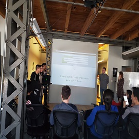

<html>
<head>
	<title>My Portfolio</title>

	<link rel="stylesheet" type="text/css" href="css/superslides.css">
	<link rel="stylesheet" type="text/css" href="css/owl.carousel.min.css">
	<link rel="stylesheet" href="https://stackpath.bootstrapcdn.com/bootstrap/4.3.1/css/bootstrap.min.css" integrity="sha384-ggOyR0iXCbMQv3Xipma34MD+dH/1fQ784/j6cY/iJTQUOhcWr7x9JvoRxT2MZw1T" crossorigin="anonymous">

	<link rel="stylesheet" href="https://cdn.jsdelivr.net/gh/fancyapps/fancybox@3.5.7/dist/jquery.fancybox.min.css" />
	
	<link rel="stylesheet" type="text/css" href="css/style.css">

	
</head>
<body>
	

		

		
	

	

		

		  

		    
		    
		    
		  

		  

		  	

		  		
ALENA ZHIGMITOVA

		  		

		  	

		  

		   <nav class="slides-navigation">
				
				
			</nav>

	

	<nav id="navigation" class="navbar navbar-expand-lg">
		 

		  <button class="navbar-toggler" type="button" data-toggle="collapse" data-target="#navbarNav" aria-controls="navbarNav" aria-expanded="false" aria-label="Toggle navigation">
		    
		  </button>

		  

		    <ul class="navbar-nav">
		      <li class="nav-item active">
		        <a class="nav-link" href="#about">About(current)</a>
		      </li>
		      <li class="nav-item">
		        <a class="nav-link" href="#skills">Skills</a>
		      </li>
		      <li class="nav-item">
		        <a class="nav-link" href="#experience">Experience</a>
		      </li>
		      <li class="nav-item">
		        <a class="nav-link" href="#contact">Contact</a>
		      </li>
		      <li class="nav-item">
		        <a class="nav-link" href="#portfolio">Projects Gallery</a>
		      </li>
		    </ul>
		  

	</nav>

	

		

			

				

					
				

				

					
					<h4>My name is Alena Zhigmitova</h4>
					
Hi There! I'm Alena Zhigmitova from Chicago, USA. I worked as a Junior Full Stack Software Engineer at EZ Local. Creative full stack developer who possesses a passion for designing fully functional, yet elegant web applications using Python, JavaScript, and C#/.NET. As a lifelong learner I am actively seeking employment opportunities where I can continue to develop my programming skills and build robust, user-friendly web applications and products.

					
I graduated from Qiqihar University in Qiqihar, China and received my Master's Degree in Business Administration and Computer Science and also spent five months in coding boot-camp studying Full Stack Web Development program with C#.Net, Python, MEAN at Coding Dojo in Chicago, IL. 

				<a href="https://github.com/Alka888/Alka888.github.io/blob/master/downloads/Resume%202%20Updated.docx">Download Resume</a>
				

				
			

		

		
	

	

		

			

				

					<h2>TECHNICAL SKILLS</h2>
					
A representation of my proficiency in each skill

				

				

				   

						
							89
							<canvas height="152" width="152"></canvas>
						
						<h4>Javascript</h4>
						
Used in most of my web based projects - 
							<a href="https://www.altantransit.com/">Altan Transit Consulting Website, </a>
							<a href="https://github.com/Alka888/loan_calculator">Loan Calculator, </a>
							<a href="">Tracalorie Project, </a>
							<a href="">My Portfolio.</a>
						

				   

				   

						
							86
							<canvas height="152" width="152"></canvas>
						
						<h4>C#/.NET Core</h4>
						
Used in three web applications -
							<a href="https://github.com/jamesjbamaung/WannaBet">Wanna Bet, </a> 
							<a href="https://github.com/Alka888/wedding-planner">Wedding Planner, </a>
							<a href="https://github.com/Alka888/chefs-dishes">Chefs&Dishes, </a>
							<a href="https://github.com/Alka888/Activity-Center">Activity Center.</a>
						

				   

				   

						
							72
							<canvas height="152" width="152"></canvas>
						
						<h4>Angular6</h4>
						
Used in three full stack projects - <a href="http://3.19.120.193/">Pet Shelter, </a> Message Board, Weather API.

				   

				    

						
							71
							<canvas height="152" width="152"></canvas>
						
						<h4>Python</h4>
						
Used in three full stack projects - Books&Authors, TV_Show, Wall.

				   

				   

						
							75
							<canvas height="152" width="152"></canvas>
						
						<h4>Node.js</h4>
						
Used in full stack project - 
							<a href="https://github.com/MichaelTaylor7/trivia_race">Trivia Race</a>
						

				   

				     

						
							95
							<canvas height="152" width="152"></canvas>
						
						<h4>HTML5</h4>
						
Used in most of my web based projects

				   

				    

						
							85
							<canvas height="152" width="152"></canvas>
						
						<h4>CSS3</h4>
						
Used in most of my web based projects

				   

				    

						
							75
							<canvas height="152" width="152"></canvas>
						
						<h4>Jquery</h4>
						
Used in most of my web based projects

				   

				    

						
							85
							<canvas height="152" width="152"></canvas>
						
						<h4>Bootstrap</h4>
						
Used in most of my web based projects

				   

				    

						
							40
							<canvas height="152" width="152"></canvas>
						
						<h4>React</h4>
						
Used in one full stack project - 
							<a href="https://github.com/Alka888/Ticking_clock-React">Ticking Clock.</a>
						

				   

				     

						
							51
							<canvas height="152" width="152"></canvas>
						
						<h4>My SQL</h4>
						
Used in three full stack projects - Books&Authors, TV_Show, Wall.

				   

				    

						
							55
							<canvas height="152" width="152"></canvas>
						
						<h4>MongoDB</h4>
						
Used in three full stack projects - 
							 <a href="http://3.19.120.193/">Pet Shelter, </a> Message Board, Weather API.
						

				   

				    

						
							65
							<canvas height="152" width="152"></canvas>
						
						<h4>Ajax</h4>
						
Used in most of my web based projects

				   

				   

						
							65
							<canvas height="152" width="152"></canvas>
						
						<h4>API</h4>
						
Used in most of my web based projects

				   

				   

						
							65
							<canvas height="152" width="152"></canvas>
						
						<h4>JSON</h4>
						
Used in most of my web based projects

				   

				

			

		

	
 

			

				

					

						

					        <h2 class="heading">EXPERIENCE</h2>
					        

					            <h4>June 2019 – September 2019 - contract</h4>
					                <h3><a href="https://www.ezlocal.com/">EZ Local</a></h3>
					                <h4>Junior Software Engineer</h4>
					                
EZlocal helps businesses manage and improve their local and social internet presence. A top ranked search directory since 2007 with millions of indexed listings, EZlocal offers complete digital presence and listings management, including high quality citation building, social media and reputation services, online advertising and amazing mobile-friendly websites. Founded in 2007, we power our work with proprietary technology (Chicago Innovation Awards Finalists) and dedicated account teams.

		       <ul>
			<li>Responsible for designing, coding and modifying websites, from layout to function and according to a client's specifications. Visually appealing sites that feature user-friendly design and clear navigation.</li>
			<li>Upgraded the Ezlocal.com website from .NET 4.0 to .NET 4.6.1 to better utilize async / await patterns on input / output methods.</li>
			<li>Developed the internal Web Application that allowed office managers to review applications.
			Developed an automated console application to generate and upload the Ezlocal.com sitemap.</li>
			<li>Technologies: C#. Net Core, JavaScript, Bootstrap, jQuery, HTML5, CSS3, GitHub, MySQL, Microsoft Azure, Responsive Web Design, Web Development.</li>
		       </ul>
			     
			    

			    <h4>February 2019 – May 2019</h4>
				<h3><a href="https://www.altantransit.com/">Altan Transit</a></h3>
				<h4>Freelance Front End Web Developer</h4>
					
Company based in Des Plaines, IL. Started as a small business in 2018. Altan Transit has united specialists of different directions with extensive practical experience in China. The company specializes in providing a range of business services between the US and China, taking into account all possible customer requirements. We have put together a team, who know the industry specifics of various goods and equipment. The result of working with Altan Transit is to increase efficiency and achieve stable, maximum high economic results in the activities of your company.

			
Created a consulting website for a client. 

			
Efficiently hand-coded using HTML5, CSS3, Bootstrap, JavaScript - http://www.altantransit.com

	    

			    <h4>September 2017 – January 2019</h4>
				<h3>Arrow Trans Corp</h3>
				<h4>Logistics Coordinator</h4>
				
Company based in Elk Grove Village, IL which is the heart of trucking in Midwest. We started as a small family business in 2009. Owner, as well as many office employees, was a truck driver in the past, therefore we know the industry from the inside out. We regularly send our team members for trainings to gain knowledge in order to keep our growth. Have a lot of long lasting relationships with brokers from various brokerage companies. 24/7 dispatchers are eager to help any day, any time. Drivers are very well experienced, skilled and prepared for every road condition. Above that, we are proudly servicing customers not only within the US, but also in Canada. We do haul various loads, as our equipment is reliable and well prepared for every challenge. 

				<ul>
					<li>Facilitated the transportation of 2,000+ shipments during 10-month tenure as sales apprentice; assisted in the generation of $1 million in company revenue and $0.7 million in gross profit.</li>
					<li> Managed the prospecting and qualifying of up to 100 leads weekly, selling logistics solutions to companies ranging from Fortune 300 corporations to small businesses; provided up to 30 daily capacity quotes for a range of services.</li>
					<li>Streamlined an internal document upload process, leveraging Google Suite, that successfully established significant time savings for all employees within the sales group.</li>
				</ul>
				    
		    

		

	

	

		

			
Like what you see?

			<h2>I'd love to hear from you!</h2>
			<a href="mailTo:alicom19900215@gmail.com" class="contactButton">GET IN TOUCH!</a>

		

			

	

		

			

				

					<h2>Project's Gallery</h2>

				

					

						<ul id="filters">
							<li><a href="#" data-filter="*" class="current">ALL</a></li>
							<li><a href="#" data-filter=".apps">Apps</a></li>
							<li><a href="#" data-filter=".me">Me</a></li>
							<li><a href="#" data-filter=".websites">Websites</a></li>
						</ul>

					

						

							<ul class="items">

								<li class="websites col-xs-6 col-sm-4 col-md-3 col-lg-3">

									

										

						

							

							

						

						

						

					

				</li>

				<li class="apps col-xs-6 col-sm-4 col-md-3 col-lg-3">

					

						

							

								

								

							

								

								

					

				</li>

				<li class="apps col-xs-6 col-sm-4 col-md-3 col-lg-3">

					

						

							

								

								

							

								

							

					

				</li>

				<li class="apps col-xs-6 col-sm-4 col-md-3 col-lg-3">

					

						

							

								

								

							

								

							

					

				</li>

				<li class="apps col-xs-6 col-sm-4 col-md-3 col-lg-3">

					

						

							

								

								

							

								

							

					

				</li>

				<li class="websites col-xs-6 col-sm-4 col-md-3 col-lg-3">

					

						

							

								

								

							

								

							

					

				</li>

				<li class="me col-xs-6 col-sm-4 col-md-3 col-lg-3">

					

						

							

								

								

							

								

							

					

				</li>

				<li class="me col-xs-6 col-sm-4 col-md-3 col-lg-3">

					

						

							

								

								

							

								

							

					

				</li>

				<li class="me col-xs-6 col-sm-4 col-md-3 col-lg-3">

					

						

							

								

								

							

								

							

					

				</li>

				<li class="apps col-xs-6 col-sm-4 col-md-3 col-lg-3">

					

						

							

								

								

							

								

							

					

				</li>

				<li class="apps col-xs-6 col-sm-4 col-md-3 col-lg-3">

					

						

							

								

								

							

								

							

					

				</li>

			</ul>

		

	

	
	
	
	

	
	
	
	
	

</body>
</html>
